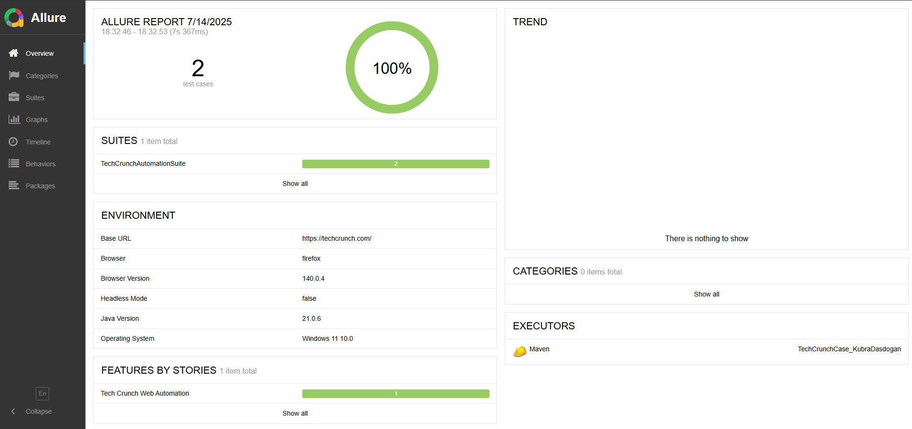

# TechCrunch Web Automation Project

**Automated tests for TechCrunch’s "Latest News" section and article details**, using Selenium, TestNG, and Allure.

---

## 🧽 Overview

This project runs end-to-end tests on TechCrunch:

* ✅ Check the **"Latest News"** list for missing authors or images.
* ✅ Open an article and verify its title and all contained links.

---

## 🛠 Prerequisites

* **Java JDK 21+**
* **Maven 3.8+**
* **IDE** (IntelliJ IDEA, VSCode, etc.)

---

## 💻 Technologies Used

* Selenium Java
* TestNG
* WebDriverManager
* Allure Reports
* Maven
* Java 21

---

## 📅 Installation

1. **Clone the repo:**

   ```bash
   git clone https://bitbucket.org/kubradas/TechCrunchCase_KubraDasdogan.git
   cd TechCrunchCase_KubraDasdogan
   ```

   Alternatively, you can download the project as a ZIP archive:
   [https://bitbucket.org/kubradas/TechCrunchCase\_KubraDasdogan/src/master/](https://bitbucket.org/kubradas/TechCrunchCase_KubraDasdogan/src/master/)

   After extracting the ZIP file, we recommend renaming the folder to:

   ```bash
   TechCrunchCase_KubraDasdogan
   ```

   to match the original project structure and make file navigation easier.

2. **Install dependencies:**

   ```bash
   mvn clean install
   ```

---

## ⚙️ Configuration

Edit the file:
`src/test/resources/config.properties`

```properties
# Site and browser settings
baseUrl=https://techcrunch.com/
browser=chrome         # chrome or firefox
headless=true          # true for headless, false for browser window
```

Alternatively, you can override these via Maven CLI:

```bash
mvn test -Dtest.browser=firefox -Dtest.headless=false
```

---

## ▶️ Running Tests

Run all tests:

```bash
mvn test
```

---

## ✅ Test Scenarios

### 1. Check Latest News

* Go to the home page.
* Under “Latest News”, make sure each news item has:

   * an **author**
   * an **image**

### 2. Verify Article Details

* Pick a news item.
* Open the article page.
* Verify:

   * The **page title** matches the news title.
   * Each **link** in the article returns **HTTP 200**.

---

## 📊 Allure Reports

After tests finish, raw results are stored at:
`target/allure-results`

To generate and open the HTML report:

```bash
mvn allure:serve
```



> **Note:** You must have Allure Commandline 2.x installed and available in your `PATH`.
>
> * macOS: `brew install allure`
> * Windows: `choco install allure`
> * Or download manually from: [https://github.com/allure-framework/allure2/releases](https://github.com/allure-framework/allure2/releases)

* 📂 Raw Results: `target/allure-results`
* 🌐 HTML Report: `target/allure-report`

---
